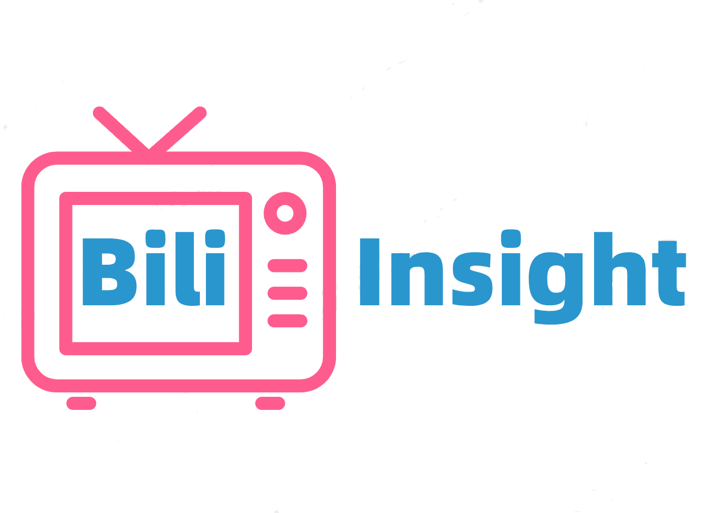
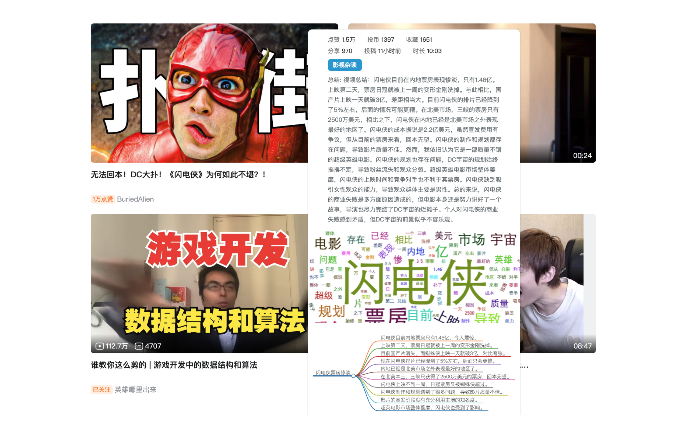
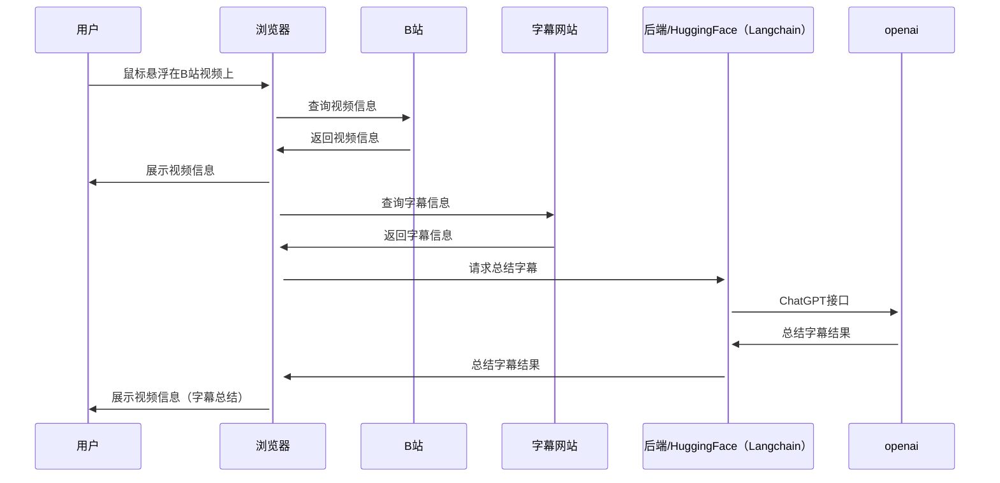

# Bili-Insight

    

Bili Insight，借助GPT洞察B站视频内容[Chrome插件](https://chrome.google.com/webstore/detail/bili-insight%EF%BC%8C%E6%B4%9E%E5%AF%9Fb%E7%AB%99%E8%A7%86%E9%A2%91%E5%86%85%E5%AE%B9%E6%8F%92%E4%BB%B6/akodljjoaekbfjacabnihcbcbioidnfg?hl=zh-CN)。它可以让你不用点开视频，以可视化的方式更快地了解视频的基本信息和总结内容。

     🤗 <a href="https://yfor-bili-insight2.hf.space/" target="_blank"> Huggingface Space</a>
     📺 <a href="https://b23.tv/P9ao5bc" target="_blank">介绍视频1</a>
     📺 <a href="https://www.bilibili.com/video/BV1KV4y1S7Rw/" target="_blank">介绍视频2</a> 
     📑 <a href="https://emoumcwvfx.feishu.cn/docx/FUNYdH8ClolsBjxrEm3crZt0nTh" target="_blank">项目规划文档</a> 
    

用户浏览B站时，把鼠标悬停至视频或标题上，插件会在视频旁弹出卡片。自动展示视频基本信息，并将总结内容通过词云&思维导图的方式以可视化的形式呈现，方便用户快速了解视频内容。

* up主视频的点赞、投币、收藏、分享数据
* up主视频的投稿时间、视频长度数据
* up主投稿视频的所在分区
* up主视频的内容总结。默认为视频简介。待请求完成后，会替换为视频内容总结
* up主视频字幕、标题、简介、tag生成的词云
## 演示示例

## 设计

### Refine链原理

###  Huggingface部署

## 加入我们
<b>1. 添加个人联系方式</b>

    
         

<b>2. 加入开发/体验/内测组</b>

    

## 参考资料
* [吕立青：BiliGPT](https://github.com/JimmyLv/BibiGPT)
* [插件：让你瞬间了解B站UP主](https://github.com/gaogaotiantian/biliscope)
* [Bilibili-Evolved](https://github.com/the1812/Bilibili-Evolved)

## LICENSE
 本作品采用<a rel="license" href="http://creativecommons.org/licenses/by-nc-sa/4.0/">知识共享署名-非商业性使用-相同方式共享 4.0 国际许可协议</a>进行许可。
