# Bili-Insight

Bili Insight，借助GPT洞察B站视频内容Chrome插件。它可以让你不用点开视频，更快地了解视频的总结内容。

    • 🤗 <a href="https://huggingface.co/spaces/yfor/Bili-Insight" target="_blank">HF Space</a>
    • 📺 <a href="https://www.bilibili.com/video/BV1KV4y1S7Rw/" target="_blank">介绍视频</a> 

用户是 B 站的视频观众，他们希望通过使用这个插件来更好地理解视频的内容。

当浏览B站时，把鼠标悬停至视频或标题时，插件会自动展示内容总结，通过词云/思维导图等方式以可视化的形式呈现给用户，方便用户快速了解视频内容。

* up主视频的点赞、投币、收藏、分享数据
* up主视频的投稿时间、视频长度数据
* up主投稿视频的所在分区
* up主视频的内容总结。默认为视频简介。待请求完成后，会替换为视频内容总结
* up主视频字幕、标题、简介、tag生成的词云
## 示例

## 参与贡献者
|                     任务                     |     负责人     |        任务类型         | 状态  |  开始时间  |  结束时间  |
| :------------------------------------------: | :------------: |:-------------------:|:---:| :--------: | :--------: |
|              产品定义、项目管理              |     [崔腾松](https://github.com/2951121599)     |      产品设计、项目管理      | 完成 | 2023/06/01 | 2023/06/09 |
| 字幕下载、格式处理、高频词统计、前端页面设计 |      [王强](https://github.com/wangqmshf)      |   前端浏览器插件开发、产品设计    | 完成 | 2023/06/03 | 2023/06/09 |
|             Prompt优化、模型调用             | [陈德港](https://github.com/cdggdc)、[梁嘉文](https://github.com/tangruofeng) | 模型、Prompt、Langchain | 完成  | 2023/06/03 | 2023/06/09 |
|            搭建后端框架、定义接口            |     [吴晓明](https://github.com/xlight5)     |        后端框架         | 完成 | 2023/06/03 | 2023/06/09 |
|             数据库存储及缓存设计             |     [朱恒璟](https://github.com/hengjingzhu)     |        数据库部署        | 完成 | 2023/06/03 | 2023/06/09 |

## 设计

```mermaid
sequenceDiagram
    participant 用户
    participant 浏览器
    participant B站

    用户->>+浏览器: 鼠标悬浮在B站视频上
    浏览器->>+B站: 查询视频信息
    B站->>+浏览器: 返回视频信息
    浏览器->>用户: 展示视频信息
    浏览器->>字幕网站: 查询字幕信息
    字幕网站->>+浏览器: 返回字幕信息
    浏览器->>+后端（Langchain）: 请求总结字幕
    后端（Langchain）->>+openai: ChatGPT接口
    openai->>+后端（Langchain）: 总结字幕结果
    后端（Langchain）->>+浏览器: 总结字幕结果
    浏览器->>用户: 展示视频信息（字幕总结）
```

### Refine链

### 配置

## 参考资料
* [吕立青：BiliGPT](https://github.com/JimmyLv/BibiGPT)
* [插件：让你瞬间了解B站UP主](https://github.com/gaogaotiantian/biliscope)
* [Bilibili-Evolved](https://github.com/the1812/Bilibili-Evolved)

## LICENSE
 本作品采用<a rel="license" href="http://creativecommons.org/licenses/by-nc-sa/4.0/">知识共享署名-非商业性使用-相同方式共享 4.0 国际许可协议</a>进行许可。
